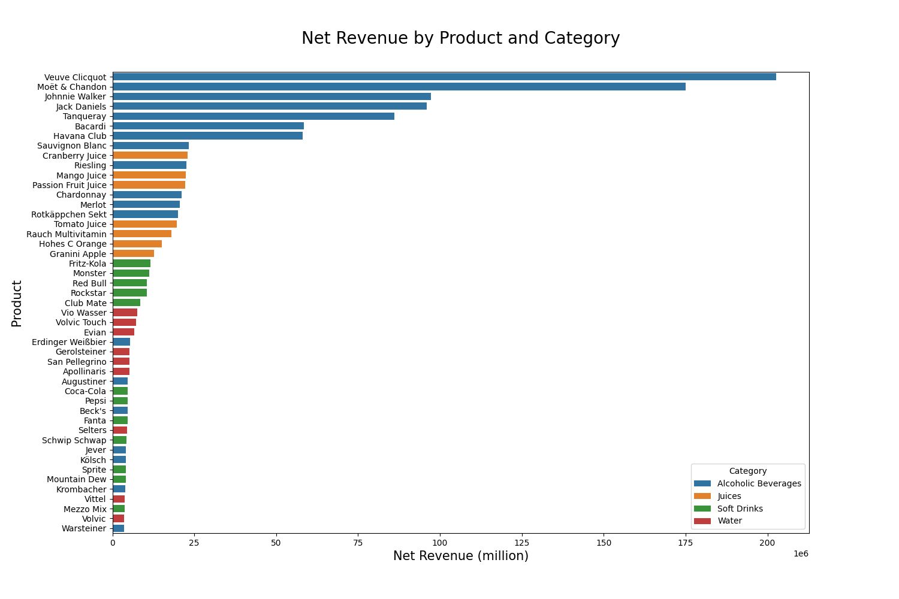

- Tech Stack
	- Python (Pandas, MatPlotLib - Pyplot, Seaborn, Numpy, Scikitlearn)
- Analysis: [Google Colab](https://colab.research.google.com/drive/1iTv_POoMBF8VqO7b0I_L4ofM7HU_4JBt?usp=sharing)
- Data: [Synthetic Beverage Sales Dataset](https://www.kaggle.com/datasets/sebastianwillmann/beverage-sales)

## 1. Overview

This project applies machine learning to a synthetic beverage sales dataset to extract actionable business insights across three analytical tracks: customer segmentation, product-region segmentation, and revenue prediction. 

----
## 2. Dataset
  
| Column        | Type        | Description                                    |
| ------------- | ----------- | ---------------------------------------------- |
| Order_ID      | String      | Unique order identification                    |
| Customer_ID   | String      | Unique customer identification                 |
| Customer_Type | Categorical | Business to Business or Business to Customer   |
| Product       | Categorical | Product Name                                   |
| Category      | Categorical | Alcoholic beverage, water, juices, soft drinks |
| Unit_Price    | Float       | Price per unit before discount                 |
| Quantity      | Integer     | number of units ordered                        |
| Discount      | Float       | Discount rate applied, only B2B sales          |
| Total_Price   | Float       | Final order value after discount               |
| Region        | Categorical | Geographic sales region                        |
| Order_Date    | Date        | Date order was placed                          |

*Note: The synthetic nature of the dataset means pricing relationships are largely deterministic — a pattern that revealed an important data leakage issue during modeling, discussed further in the revenue prediction section.*

----
## 3. Exploratory Data Analysis

### 3.1 Product Revenue by Product and Category

- 71% of revenue comes from top 20% of SKUs
### 3.2 Revenue by Region
![[revenue_by_region.png]]

-----
## 4. Customer Segmentation

Q: Who are our customers and how do their purchasing behaviors differ? 

RFM analysis was performed at the customer level by computing Recency (days since last order), Frequency (total unique orders), and Monetary value (total spend) per `Customer_ID`. All three features were scaled using `StandardScaler` before clustering, as K-Means is distance-based and sensitive to feature scale. The optimal number of clusters was selected using the elbow method and silhouette scoring, resulting in k=4.

The four clusters produced the following profiles based on their centroids:

| Cluster | Recency (days) | Frequency (purchases) | Monetary    | Description                 |
| ------- | -------------- | --------------------- | ----------- | --------------------------- |
| 0       | 3.11           | 284.46                | $46,809.22  | Regular Low Spenders        |
| 1       | 3.32           | 301.75                | $255,809.55 | Champions                   |
| 2       | 3.06           | 313.26                | $44,669.14  | Frequent Low-Value Spenders |
| 3       | 11.84          | 295.60                | $101,926    | At-Risk / Mid-Spenders      |
 
 Cluster 1 represents the highest-value customers — recent, frequent, and high-spending. Cluster 3 is the most actionable segment, with a recency of 11.84 days compared to ~3 days for all other clusters, signaling disengagement despite reasonable monetary value. Cluster 2 stands out as the most frequent buyers but with the lowest spend, suggesting heavy discount usage or small-basket purchasing behavior.

![[customer_cluster_3d_scatter.png]]

----
## 5. Product-Region Segmentation

Q: How do products perform across regions, and which are staples vs niche vs underperformers?

A product-region feature matrix was constructed by pivoting total revenue, average quantity, average discount, and order frequency across all `Product × Region` combinations. This produced a multi-dimensional view of how each product behaves across every region simultaneously. The matrix was scaled and fed into K-Means.

Product - Region Clustering:

| Cluster | Revenue       | Quantity | Description                  | No. of Products |
| ------- | ------------- | -------- | ---------------------------- | --------------- |
| 0       | Average       | Low      | Premium Priced Products      | 17              |
| 1       | Below Average | High     | Volume Products              | 21              |
| 2       | Moderate      | High     | Staple Products              | 7               |
| 3       | High          | Low      | Premium / Exclusive Products | 2               |
Region - Product Clustering:

| Cluster | Revenue | Quantity | Description           | No. of Regions |
| ------- | ------- | -------- | --------------------- | -------------- |
| 0       | High    | High     | High Performing       | 4              |
| 1       | Low     | Low      | Low Performing        | 11             |
| 2       | Mixed   | Mixed    | Polarized Performance | 1              |
 

The revenue heat map, normalized by product row, reveals the distribution of each product's revenue across regions. Products with even distributions (~equal % per region) are regional staples with consistent demand, while products with one dominant cell are regional exclusives.

![[product_region_heatmap.png]]

----
## 6. Revenue Prediction

Q: Can we predict order-level revenue from behavioral and contextual features?

Three models were trained and evaluated: Linear Regression as a baseline, K-Nearest Neighbors, and Histogram-Based Gradient Boosting Regression (HGBR). Customer segment labels and product-region cluster labels from the previous two tracks were merged back into the original dataframe and included as features, allowing the model to leverage behavioral context in addition to raw order attributes.

| Feature         | Correlation |
| --------------- | ----------- |
| Unit_Price      | 0.62        |
| Effective_Price | 0.59        |
| Quantity        | 0.31        |
| Discount        | 0.25        |
| RP_Cluster      | 0.08        |
| Product         | 0.03        |
| Month           | 0.00        |
| Quarter         | 0.00        |
| Day_of_Week     | 0.00        |
| Is_Weekend      | 0.00        |
| Region          | 0.00        |
| RFM_Cluster     | -0.02       |
| Customer_Type   | -0.22       |
| Category        | -0.26       |

A key finding during this phase was the impact of `Unit_Price` on model performance. Because the synthetic dataset uses a deterministic pricing formula, `Unit_Price` alone drives R² significantly upward — not because the model is learning complex patterns but because it is effectively reconstructing the target variable. Multiple feature set configurations were tested to isolate this effect:

| Model             | Feature Set         | R^2    | % of Increase |
| ----------------- | ------------------- | ------ | ------------- |
| Linear Regression | Original            | 0.4784 |               |
| KNN               | Original            | 0.9987 |               |
| HGBR              | Original            | 0.9955 |               |
| Linear Regression | Original + Clusters | 0.8635 | +80.4974%     |
| KNN               | Original + Clusters | 0.9994 | +0.0709%      |
| HGBR              | Original + Clusters | 0.9975 | +0.2009%      |
The most striking result is the 80.50% R² improvement in Linear Regression when cluster labels are added — jumping from 0.4784 to 0.8635. This indicates that customer and product-region segments carry strong explanatory power that the original features alone could not capture linearly. The near-perfect scores for KNN and HGBR are a consequence of the synthetic dataset's low variance and deterministic pricing structure rather than genuine generalization ability — in a real-world setting these scores would be lower and the relative improvement from cluster features would be more pronounced.
### 6.1 Predicted vs Actual Revenue 
The following models are trained with original + cluster features

- Linear Regression
![[lr_pva.png]]
- KNN
![[knn_pva.png]]
- HGBR
![[hgbr_pva.png]]

--- 
## 7. Key Findings

- **Re-engage At-Risk / Mid-Spender customers.** They have the highest average recency of 11.84 days, which is at least 4x longer than all the other customer types. They have an average spending of about $101,926 with ranks them the 2nd highest spenders of all 4 customer types. A well targeted campaign to get a new order can easily place them back in Champion territory.

- **Use regional cluster similarity for campaign efficiency**. Grouping campaign strategies based on over performing and under performing regions, on product preference and purchasing behavior, rather than individual campaigns   can reduce marketing overhead while maintaining relevance. Individual campaigns can be performed for polarized regions where campaigning will need to be looked at from a product level.

- **Create a new discount policy.** Discount have a positive correlation of 0.25 with Total_Price meaning as high discounts are associated with high revenue. This is because discounts are applied to every B2B orders where total price remains high despite the reduction. This suggests a blanket discount policy is inplace and ineffect. A new policy tied to volume should be applied uniformly towards all B2B orders. This will incentives higher purchase volumes.

----
## 8. Limitations & Next Steps
- The dataset is synthetic with a deterministic pricing formula, which inflates model scores and limits the realism of results. Real-world data would introduce noise from returns, promotions, and external demand factors that would bring scores into a more typical 0.70–0.85 R² range. Data leakage from pricing features was identified and managed, but the synthetic structure means any pricing feature retains partial leakage risk.
- Next steps include reengineering the data set to represent realistic trends, building a churn prediction model using the At-Risk cluster as the positive class, extending the analysis with time-series demand forecasting per product-region cluster, and deploying the revenue model as an interactive dashboard for scenario planning.
